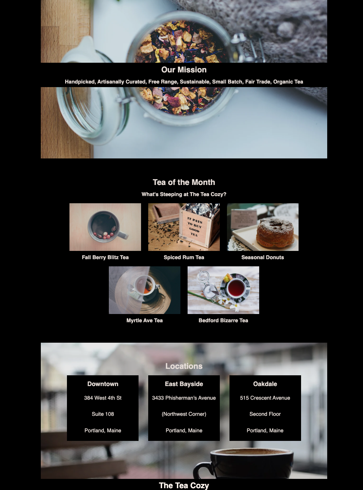

# Table of Contents

- [Table of Contents](#table-of-contents)
  - [Description](#description)
  - [ViewProject](#viewproject)
  - [Installation](#installation)
  - [Usage](#usage)
  - [License](#license)
  - [Contributing](#contributing)
  - [Tests](#tests)
  - [Questions](#questions)

## Description

<h3>Tea Cozy (Best tea in town)</h3>

Nestled in the heart of our bustling town lies a sanctuary for tea aficionados, a haven known simply as "Tea Cozy." This charming tea shop, with its weathered brick walls adorned with eclectic artwork and cozy mismatched furniture, exudes an aura of vintage chic. As you step inside, the aroma of freshly brewed teas greets you like an old friend, wrapping you in a comforting embrace of fragrant steam and nostalgia.

The ambiance of Tea Cozy is as unique as its offerings, with soft jazz melodies wafting through the air and the gentle hum of chatter from patrons savoring their cups of liquid bliss. The walls are adorned with shelves upon shelves of ornate tea canisters, each containing a treasure trove of exotic leaves sourced from the farthest corners of the globe. From delicate Darjeeling to robust Pu-erh, there's a brew to suit every palate and mood.

## ViewProject

## Installation

N/A

## Usage  

You can use this website to find the Best tea in Town.

## License

## Contributing

Helder Balbino

## Tests

N/A

## Questions

N/A
